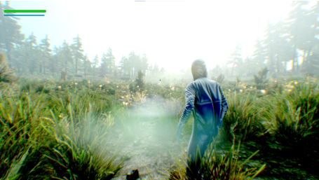
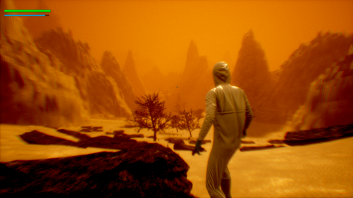
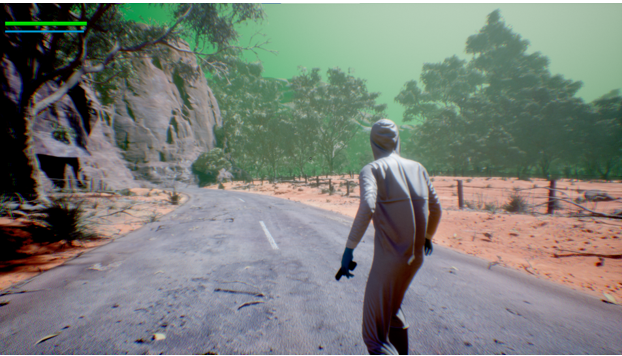
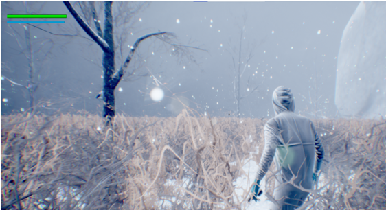

<h2>Geoportals</h2>

In the future where portals are used for transportation within the earth, a portal is accidentally opened to another world which brings dangerous alien creatures and a toxic substance polluting the atmosphere.

** The game has been submitted to the Store, but hasn't been published as of writing this.**

The game is availabe to download for free on Windows 10 and 11 devices.

## Description
Geoportals is a third-person shooter built using Unreal Engine 4. The gameplay involves shooting aliens, navigating the levels and finding portals. There are various enemy types, and each level has a different climate and atmosphere, each with different enemy variants and types. The game supports Xbox controller and keyboard + mouse for input out of the box. For in-depth documentation, refer to the <a href='Documentation.pdf'>documentation</a>.

## Plot
After accidentally opening a portal to another world, alien creatures occupy the earth and bring with them a hostile gas that makes oxygen toxic to human beings. The game follows one of the scientists from the organization that is responsible for creating portals as a means of transportation on earth. This scientist must follow the portal path to find the source of the portal to the alien world in order to shut it down. On her way there, she must survive alien creatures that can kill her as she makes her way from one portal to another.

## Screenshots
<table><tr>
<td>  </td>
<td>  </td>
<td>  </td>
<td>  </td>
</tr></table>

## Building
While this repository contains all of the source code, it does not contain a lot of assets such as levels, Marketplace packages, etc due to their large sizes exceeding GitHub's file size limit. Essentially, you might not be able to build this, and if you do manage to do so, you will find that a lot of references would be missing. Why is this open-source then? Showing off, of course. Also because at one point the whole project was in this repo, but as time went on and I started to import packages and create large maps, that was no longer possible.

## License
This project is licensed under the GNU General Public License 3.

## References 
Please see the <a href='Credits.txt'>credits</a> file. 
  
